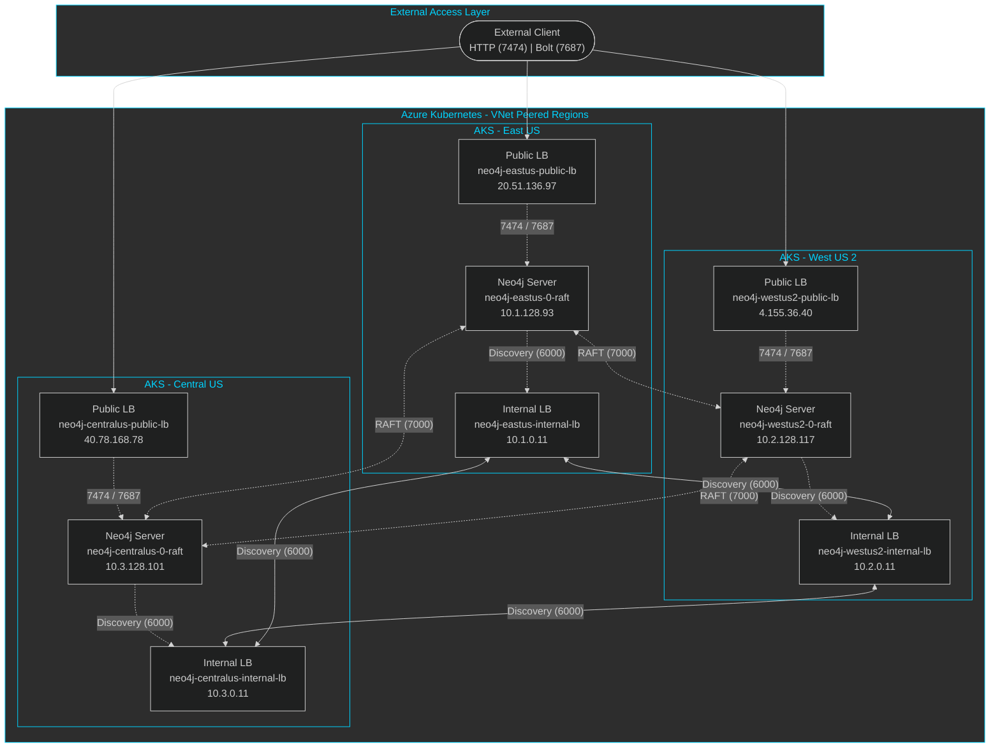

# Neo4j Multi-Region Cluster on Azure Kubernetes Service (AKS)

This document describes the architecture and deployment of a geo-distributed Neo4j Enterprise cluster across three Azure regions using Azure Kubernetes Service (AKS).

## Table of Contents

- [Overview](#overview)
- [Architecture Diagram](#architecture-diagram)
- [Azure Infrastructure](#azure-infrastructure)
  - [Regions](#regions)
  - [Virtual Networks](#virtual-networks)
  - [VNet Peering](#vnet-peering)
  - [AKS Clusters](#aks-clusters)
- [Network Configuration](#network-configuration)
  - [Load Balancers](#load-balancers)
  - [DNS Configuration](#dns-configuration)
  - [NSG Rules](#nsg-rules)
- [Identity and Access](#identity-and-access)
  - [Workload Identity](#workload-identity)
  - [Service Accounts](#service-accounts)
- [Neo4j Configuration](#neo4j-configuration)
  - [Cluster Topology](#cluster-topology)
  - [RAFT Communication](#raft-communication)
  - [Discovery Configuration](#discovery-configuration)
- [Deployment](#deployment)
  - [Prerequisites](#prerequisites)
  - [Helm Chart Configuration](#helm-chart-configuration)
  - [StatefulSet Patching](#statefulset-patching)
- [Connectivity](#connectivity)
  - [External Access](#external-access)
  - [Internal Communication](#internal-communication)
- [Verification](#verification)

---

## Overview

This deployment creates a **3-region Neo4j Enterprise cluster** with the following characteristics:

| Feature | Description |
|---------|-------------|
| **Pattern** | Geo-distributed 3DC (3 Data Centers) |
| **Regions** | East US, West US 2, Central US |
| **Neo4j Version** | 5.26.0 |
| **Helm Chart Version** | 5.26.16 |
| **Kubernetes Version** | 1.29 |
| **Network Plugin** | Azure CNI (Standard, non-overlay) |

### Key Design Decisions

1. **Standard Azure CNI**: Provides routable pod IPs across peered VNets
2. **Dynamic DNS Registration**: Init containers register pod IPs in Azure Private DNS for RAFT communication
3. **Dual Load Balancer Strategy**: Internal LBs for discovery, Public LBs for client access
4. **Azure Workload Identity**: Secure, credential-free authentication for DNS updates

---

## Architecture Diagram



---

## Azure Infrastructure

### Regions

| Region | Purpose | Resource Naming |
|--------|---------|-----------------|
| **East US** | Primary region | `neo4j-aks-eastus`, `neo4j-vnet-eastus` |
| **West US 2** | Secondary region | `neo4j-aks-westus2`, `neo4j-vnet-westus2` |
| **Central US** | Tertiary region | `neo4j-aks-centralus`, `neo4j-vnet-centralus` |

### Virtual Networks

Each region has a dedicated VNet with separate subnets for AKS nodes and pods:

| Region | VNet CIDR | AKS Subnet | Pod Subnet |
|--------|-----------|------------|------------|
| East US | `10.1.0.0/16` | `10.1.0.0/20` | `10.1.128.0/17` |
| West US 2 | `10.2.0.0/16` | `10.2.0.0/20` | `10.2.128.0/17` |
| Central US | `10.3.0.0/16` | `10.3.0.0/20` | `10.3.128.0/17` |

**Why separate pod subnets?**
- Standard Azure CNI assigns routable IPs from the pod subnet
- Pods can communicate directly across peered VNets
- Required for direct pod-to-pod RAFT communication on port 7000

### VNet Peering

Full mesh peering is configured between all three VNets:

```
East US <-----> West US 2
   ^               ^
   |               |
   v               v
      Central US
```

| Peering Name | Source VNet | Destination VNet |
|--------------|-------------|------------------|
| `eastus-to-westus2` | neo4j-vnet-eastus | neo4j-vnet-westus2 |
| `westus2-to-eastus` | neo4j-vnet-westus2 | neo4j-vnet-eastus |
| `eastus-to-centralus` | neo4j-vnet-eastus | neo4j-vnet-centralus |
| `centralus-to-eastus` | neo4j-vnet-centralus | neo4j-vnet-eastus |
| `westus2-to-centralus` | neo4j-vnet-westus2 | neo4j-vnet-centralus |
| `centralus-to-westus2` | neo4j-vnet-centralus | neo4j-vnet-westus2 |

### AKS Clusters

Each region has an AKS cluster with:

| Configuration | Value |
|---------------|-------|
| **Kubernetes Version** | 1.29 |
| **Network Plugin** | Azure CNI (Standard) |
| **System Node Pool** | 3 x Standard_D4s_v3 |
| **Neo4j Node Pool** | 4 x Standard_E16as_v5 |
| **Workload Identity** | Enabled |
| **OIDC Issuer** | Enabled |

---

## Network Configuration

### Load Balancers

Each region has two LoadBalancer services:

#### Internal Load Balancer (Private)
- **Purpose**: Discovery and internal cluster communication
- **Type**: Internal Azure Load Balancer
- **IP**: Static private IP from AKS subnet (e.g., `10.1.0.11`)
- **Ports**: 6000 (Discovery), 7688 (Bolt Routing), 6362 (Backup)

| Region | Service Name | IP |
|--------|--------------|-----|
| East US | `neo4j-eastus-internal-lb` | `10.1.0.11` |
| West US 2 | `neo4j-westus2-internal-lb` | `10.2.0.11` |
| Central US | `neo4j-centralus-internal-lb` | `10.3.0.11` |

#### Public Load Balancer (External)
- **Purpose**: Client access (Browser, Bolt)
- **Type**: Public Azure Load Balancer
- **IP**: Dynamic public IP
- **Ports**: 7474 (HTTP/Browser), 7687 (Bolt)

| Region | Service Name | Public IP |
|--------|--------------|-----------|
| East US | `neo4j-eastus-public-lb` | `20.51.136.97` |
| West US 2 | `neo4j-westus2-public-lb` | `4.155.36.40` |
| Central US | `neo4j-centralus-public-lb` | `40.78.168.78` |

### DNS Configuration

#### Azure Private DNS Zone

- **Zone Name**: `neo4j.internal`
- **Resource Group**: `jhair_mrc_rg`
- **Linked VNets**: All three regional VNets

#### DNS Records

**RAFT DNS Records** (Dynamic, updated by init container):

| Record | Type | Target | Purpose |
|--------|------|--------|---------|
| `neo4j-eastus-0-raft` | A | `10.1.128.93` | RAFT advertised address |
| `neo4j-westus2-0-raft` | A | `10.2.128.117` | RAFT advertised address |
| `neo4j-centralus-0-raft` | A | `10.3.128.101` | RAFT advertised address |

**LoadBalancer DNS Records** (Static):

| Record | Type | Target | Purpose |
|--------|------|--------|---------|
| `neo4j-eastus-internal-lb` | A | `10.1.0.11` | Discovery endpoint |
| `neo4j-westus2-internal-lb` | A | `10.2.0.11` | Discovery endpoint |
| `neo4j-centralus-internal-lb` | A | `10.3.0.11` | Discovery endpoint |
| `neo4j-eastus-public-lb` | A | Public IP | Client access |
| `neo4j-westus2-public-lb` | A | Public IP | Client access |
| `neo4j-centralus-public-lb` | A | Public IP | Client access |

### NSG Rules

Network Security Groups are configured to allow RAFT traffic between pod subnets:

**Inbound Rules** (Priority 1000-1002):
```
Allow TCP 7000 from 10.1.128.0/17 (eastus pods)
Allow TCP 7000 from 10.2.128.0/17 (westus2 pods)
Allow TCP 7000 from 10.3.128.0/17 (centralus pods)
```

**Outbound Rules** (Priority 2000-2002):
```
Allow TCP 7000 to 10.1.128.0/17 (eastus pods)
Allow TCP 7000 to 10.2.128.0/17 (westus2 pods)
Allow TCP 7000 to 10.3.128.0/17 (centralus pods)
```

---

## Identity and Access

### Workload Identity

Azure Workload Identity is used for secure, credential-free authentication to Azure services.

#### User-Assigned Managed Identity

| Property | Value |
|----------|-------|
| **Name** | `neo4j-dns-updater-identity` |
| **Role** | Private DNS Zone Contributor |
| **Scope** | Private DNS Zone (`neo4j.internal`) |

#### Federated Credentials

Each AKS cluster has a federated credential linking the Kubernetes service account to the Azure identity:

| Region | Federated Credential Name | OIDC Issuer |
|--------|---------------------------|-------------|
| East US | `neo4j-dns-federated-eastus` | AKS OIDC Issuer URL |
| West US 2 | `neo4j-dns-federated-westus2` | AKS OIDC Issuer URL |
| Central US | `neo4j-dns-federated-centralus` | AKS OIDC Issuer URL |

### Service Accounts

Each AKS cluster has a Kubernetes service account configured for Workload Identity:

```yaml
apiVersion: v1
kind: ServiceAccount
metadata:
  name: neo4j-dns-updater
  namespace: neo4j
  annotations:
    azure.workload.identity/client-id: "<IDENTITY_CLIENT_ID>"
  labels:
    azure.workload.identity/use: "true"
```

---

## Neo4j Configuration

### Cluster Topology

| Property | Value |
|----------|-------|
| **Edition** | Enterprise |
| **Mode** | Cluster |
| **Minimum Servers** | 3 |
| **Initial Members** | 3 (one per region) |

### RAFT Communication

RAFT consensus (port 7000) uses **direct pod-to-pod communication** via Dynamic DNS:

1. **Init Container**: Runs before Neo4j starts
2. **DNS Registration**: Uses Azure CLI with Workload Identity to register pod IP
3. **RAFT Address**: `neo4j-<region>-0-raft.neo4j.internal:7000`

#### Init Container Flow

```
Pod Starts
    │
    ▼
Init Container
    │
    ├─► Get Pod IP (hostname -i)
    │
    ├─► Azure Login (federated token)
    │
    ├─► Register DNS Record
    │   neo4j-<region>-0-raft.neo4j.internal → Pod IP
    │
    └─► Exit (success)
    
    ▼
Neo4j Container Starts
    │
    └─► RAFT uses DNS name to find peers
```

#### RAFT Configuration

```
server.cluster.raft.advertised_address=neo4j-<region>-0-raft.neo4j.internal:7000
server.cluster.raft.listen_address=0.0.0.0:7000
```

### Discovery Configuration

Discovery (port 6000) uses **LoadBalancer DNS** for NAT-friendly communication:

```
initial_discovery_members=neo4j-eastus-internal-lb.neo4j.internal:6000,neo4j-westus2-internal-lb.neo4j.internal:6000,neo4j-centralus-internal-lb.neo4j.internal:6000
```

---

## Deployment

### Prerequisites

- Azure CLI (`az`)
- kubectl
- Helm 3.x
- Azure subscription with sufficient quota

### Helm Chart Configuration

The Neo4j Helm chart is deployed with custom values for each region:

```yaml
neo4j:
  name: neo4j-<region>
  edition: enterprise
  password: "<password>"
  minimumClusterSize: 3

volumes:
  data:
    mode: dynamic
    dynamic:
      storageClassName: managed-premium

services:
  neo4j:
    enabled: false  # Disabled - using custom LoadBalancers

config:
  server.cluster.system_database_mode: PRIMARY
  server.cluster.raft.advertised_address: "neo4j-<region>-0-raft.neo4j.internal:7000"
  server.cluster.raft.listen_address: "0.0.0.0:7000"
  server.discovery.advertised_address: "neo4j-<region>-internal-lb.neo4j.internal:6000"
  server.discovery.listen_address: "0.0.0.0:6000"
  initial_discovery_members: "<all-internal-lb-dns>:6000"
  dbms.routing.default_router: SERVER

podSpec:
  serviceAccountName: neo4j-dns-updater
  initContainers:
    - name: dns-updater
      image: mcr.microsoft.com/azure-cli:latest
      command: ["/bin/sh", "-c"]
      args:
        - |
          POD_IP=$(hostname -i | awk '{print $1}')
          az login --federated-token --service-principal \
            -u $AZURE_CLIENT_ID \
            -t $AZURE_TENANT_ID \
            --federated-token $(cat $AZURE_FEDERATED_TOKEN_FILE)
          az network private-dns record-set a add-record \
            --resource-group <rg> \
            --zone-name neo4j.internal \
            --record-set-name neo4j-<region>-0-raft \
            --ipv4-address $POD_IP
```

### StatefulSet Patching

The Neo4j Helm chart's `podSpec.labels` doesn't apply labels to the pod template. A post-deployment patch is required for Workload Identity:

```bash
kubectl patch statefulset neo4j-<region> -n neo4j --type='json' -p='[
  {"op": "add", "path": "/spec/template/metadata/labels/azure.workload.identity~1use", "value": "true"}
]'
```

This adds the `azure.workload.identity/use: "true"` label, which triggers AKS to inject:
- `AZURE_CLIENT_ID`
- `AZURE_TENANT_ID`
- `AZURE_FEDERATED_TOKEN_FILE`

---

## Connectivity

### External Access

| Region | Browser URL | Bolt URI |
|--------|-------------|----------|
| East US | http://20.51.136.97:7474 | bolt://20.51.136.97:7687 |
| West US 2 | http://4.155.36.40:7474 | bolt://4.155.36.40:7687 |
| Central US | http://40.78.168.78:7474 | bolt://40.78.168.78:7687 |

**Credentials**:
- Username: `neo4j`
- Password: (set during deployment)

### Internal Communication

| Traffic Type | Port | Path | DNS Pattern |
|--------------|------|------|-------------|
| **RAFT** | 7000 | Direct pod-to-pod | `neo4j-<region>-0-raft.neo4j.internal` |
| **Discovery** | 6000 | Via Internal LB | `neo4j-<region>-internal-lb.neo4j.internal` |
| **Bolt Routing** | 7688 | Via Internal LB | `neo4j-<region>-internal-lb.neo4j.internal` |
| **Backup** | 6362 | Via Internal LB | `neo4j-<region>-internal-lb.neo4j.internal` |

---

## Verification

### Verify Cluster Formation

Connect to Neo4j Browser and run:

```cypher
SHOW SERVERS;
```

Expected output: 3 servers with `ENABLED` status.

### Verify RAFT Connectivity

Check logs for successful RAFT connections:

```bash
kubectl logs -n neo4j neo4j-eastus-0 | grep -E "RAFT|7000|channel"
```

Expected: `Initializing server channel to` messages for remote pods.

### Verify DNS Resolution

From within a pod:

```bash
kubectl exec -n neo4j neo4j-eastus-0 -- nslookup neo4j-westus2-0-raft.neo4j.internal
```

### Verify Pod-to-Pod Connectivity

```bash
kubectl exec -n neo4j neo4j-eastus-0 -- nc -zv 10.2.128.117 7000
```

---

## Files

| File | Description |
|------|-------------|
| `deployNeo4jMultiRegion.sh` | Main deployment script |
| `yaml/values-eastus.yaml` | Helm values for East US |
| `yaml/values-westus2.yaml` | Helm values for West US 2 |
| `yaml/values-centralus.yaml` | Helm values for Central US |

---

## Troubleshooting

### Init Container Fails

Check init container logs:
```bash
kubectl logs -n neo4j neo4j-eastus-0 -c dns-updater
```

Common issues:
- Missing Workload Identity label on pod
- Federated credential not configured
- DNS Zone permissions

### RAFT Connection Failures

1. Verify NSG rules allow port 7000
2. Check DNS resolution from pod
3. Verify VNet peering is active
4. Check pod IP is registered in DNS

### Cluster Not Forming

1. Verify all 3 pods are running
2. Check discovery addresses are correct
3. Verify Internal LB IPs are accessible
4. Check Neo4j logs for connection errors

---

## References

- [Neo4j Kubernetes Operations Manual](https://neo4j.com/docs/operations-manual/current/kubernetes/)
- [Neo4j Helm Charts](https://neo4j.com/docs/operations-manual/current/kubernetes/helm-charts-setup/)
- [Azure Workload Identity](https://learn.microsoft.com/en-us/azure/aks/workload-identity-overview)
- [Azure Private DNS](https://learn.microsoft.com/en-us/azure/dns/private-dns-overview)
- [Azure VNet Peering](https://learn.microsoft.com/en-us/azure/virtual-network/virtual-network-peering-overview)