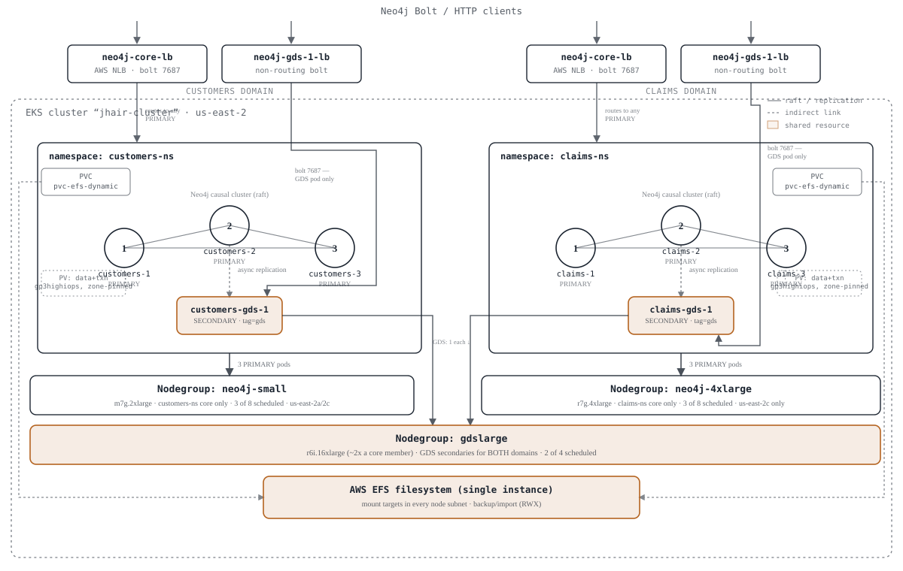

# Neo4j Hybrid GDS Cluster on AWS EKS

A reference deployment of a **Neo4j Enterprise hybrid cluster** on EKS:

- 3 core **PRIMARY** members
- 0-2 secondary **GDS** (Graph Data Science) members (opt-in: `startall.sh --gds-count {0,1,2}`, default `0`)
- 1 Network Load Balancer (NLB) fronting the core members
- 1 NLB per GDS member (GDS calls run over a non-routing Bolt connection, so
  each GDS secondary needs its own direct entry point rather than sharing
  the core LB)
- Load balancers are left running across `stopall.sh --uninstall-neo4j`
  runs, on purpose, so their IPs (and any attached ACM cert) survive a
  reinstall — this repo has no DNS, so a recreated LB with a new IP would
  break TLS

See [CLAUDE.md](CLAUDE.md) for the full set of design decisions and gotchas
(load balancer controller requirements, storage/EFS provisioning, cluster
topology, memory sizing, etc.) — this file covers the practical "how do I
run it" side.

## Naming

| Component | Name |
|---|---|
| EKS cluster | `jhair-cluster` |
| Core nodegroup | `neo4j-small` (override with `--nodegroup`) |
| GDS nodegroup | `gdslarge` (override with `--gds-nodegroup`; ~2x a core member's CPU/memory, per GDS's own sizing rule of thumb) |
| Namespace | `<domain-name>-ns` (default domain `neo4j` → `neo4j-ns`) |
| Core Helm releases | `<domain-name>-1`, `<domain-name>-2`, `<domain-name>-3` (default → `neo4j-1/2/3`) |
| GDS Helm releases | `<domain-name>-gds-1`, `<domain-name>-gds-2` (default → `neo4j-gds-1/2`) |
| Core load balancer | `neo4j-core-lb` (manifest: `lb-neo4j-core.yaml`) |
| GDS load balancers | `neo4j-gds-1-lb`, `neo4j-gds-2-lb` (manifests: `lb1-gds.yaml`, `lb2-gds.yaml`) |

`--domain-name` (see below) drives both the namespace and the Helm release
prefix, so independent domains (e.g. `claims`, `customers`) can be deployed
side by side on the same cluster, each fully isolated in its own namespace.

## Load balancer → Neo4j port mapping

Each NLB exposes two ports. TLS termination is currently **disabled** (no
ACM cert provisioned in this account/region — see `CLAUDE.md`), so the
`http` listener is plain, unencrypted port 80 rather than 443:

| LB listener port | Protocol | Forwards to (pod `targetPort`) | Purpose |
|---|---|---|---|
| `7687` | TCP | `7687` (Bolt) | Driver/Browser Bolt connections |
| `80` | TCP | `7474` (HTTP) | Neo4j Browser web UI |

To re-enable TLS termination: get a real ACM cert ARN in the same AWS
account/region as the cluster, change the `http` listener's `port: 80` back
to `443` in `lb-neo4j-core.yaml`/`lb1-gds.yaml`/`lb2-gds.yaml`, and uncomment
the `service.beta.kubernetes.io/aws-load-balancer-ssl-cert`/
`ssl-negotiation-policy` annotations in each file.

## Deploying

```bash
# Full deploy: cluster, nodegroup, namespace, secret/licenses, EFS, storage
# classes, Neo4j core installs, and the core load balancer. Also the
# default with no arguments -- runs to completion with no prompts. GDS is
# opt-in (see --gds-count below), so this alone is core-only.
./scripts/startall.sh --all

# Or just the k8s/AWS infrastructure, without installing Neo4j:
./scripts/startall.sh --k8s

# Add 1 or 2 GDS secondaries (and their load balancers) -- default is 0:
./scripts/startall.sh --gds-count 2

# Optionally override the EKS cluster name and/or the domain name (defaults:
# jhair-cluster, neo4j). --domain-name drives the namespace (<domain-name>-ns)
# and the Helm release prefix (<domain-name>-1/2/3, <domain-name>-gds-1/2):
./scripts/startall.sh --cluster-name my-cluster --domain-name mydb

# Pin this domain's core members and/or GDS secondaries to specific
# nodegroups (both must already exist in eks_create_cluster-jhair.yaml;
# defaults: neo4j-small, gdslarge):
./scripts/startall.sh --domain-name mydb --nodegroup neo4j-4xlarge --gds-nodegroup gdslarge
```

### Multiple domains on one cluster

Since `--domain-name` fully namespaces a deployment, independent domains can
be deployed side by side on the same cluster:

```bash
./scripts/startall.sh --domain-name claims --nodegroup neo4j-4xlarge --gds-count 1
./scripts/startall.sh --domain-name customers --nodegroup neo4j-small --gds-count 1
```

Each gets its own namespace, Helm releases, and load balancers, and can pin
its core members to a different nodegroup via `--nodegroup` (see above). What
they still share by default: the EFS filesystem/storage classes, and the
`gdslarge` nodegroup every domain's GDS secondaries land on unless
`--gds-nodegroup` says otherwise. Make sure each nodegroup's node count (see
`eks_create_cluster-jhair.yaml`) is large enough for however many domains
actually schedule onto it — one node per Neo4j pod (core + GDS secondaries),
per Neo4j's own recommendation against colocating more than one server per
node. Because `gdslarge` defaults identically for every domain, tearing one
domain down with `stopall.sh --all` will delete it out from under any other
domain's still-running GDS members unless that domain is torn down in the
same invocation (see `CLAUDE.md`).

`startall.sh` writes any files it needs to generate for a deployment into
`deployed-<cluster>-<domain>/` (gitignored) — one directory per
cluster+domain combination, so multiple deployments can coexist without
overwriting each other's record. This includes `deployment.env`, which
records the cluster name, namespace, release prefix, core/GDS nodegroup
scaling config, and GDS count actually used. `stopall.sh` finds these
automatically:

```bash
# If exactly one deployed-*/ directory exists, stopall.sh uses it without
# any extra flags:
./scripts/stopall.sh --uninstall-neo4j

# If you've deployed more than one (different --cluster-name/--domain-name),
# point stopall.sh at the right one the same way you deployed it:
./scripts/stopall.sh --all --cluster-name my-cluster --domain-name mydb
```

If more than one `deployed-*/` directory matches and `--cluster-name` alone
doesn't narrow it to one, `stopall.sh` lists them and asks you to
disambiguate with `--domain-name` too rather than guessing which cluster to
tear down. Passing `--cluster-name` **alone** against multiple matching
domains is not treated as ambiguous, though — every domain under that
cluster is torn down (there's nothing unclear about "tear down everything
on this cluster").

Every run of `startall.sh`/`stopall.sh` also logs its full output to
`startup-<domain>.log`/`stopall-<domain>.log` (or `stopall-<cluster>-all-domains.log`
when tearing down multiple domains in one run) in addition to the screen —
no manual `tee` redirection needed.

At the end, `startall.sh` prints the Bolt/Browser URLs for the core LB and
each GDS LB (if any), plus the login credentials. If you deployed GDS
secondaries, once every pod shows `1/1 Running`, replicate the database out
to them by running this against the core LB (or a core pod):

```cypher
-- SECONDARY count should match whatever --gds-count you deployed with
ALTER DATABASE neo4j SET TOPOLOGY 3 PRIMARY 2 SECONDARY
```

### Neo4j Credentials

Username/password come from the `neo4jpwd` secret, set by the `NEO4J_AUTH`
variable in `scripts/startall.sh`.

## Tearing down

`scripts/stopall.sh` takes independent, combinable options and does nothing
(just prints usage) if you run it with no arguments, since it's destructive:

```bash
# Uninstall Neo4j only (Helm releases + wipe their data/transactions PVs).
# Leaves load balancers, nodegroup, cluster, and EFS running.
./scripts/stopall.sh --uninstall-neo4j

# Also delete the load balancers:
./scripts/stopall.sh --uninstall-neo4j --undeploy-lb

# Full wipe: Neo4j + load balancers + nodegroup + EKS cluster + EFS.
# --all implies --uninstall-neo4j and --undeploy-lb, since skipping either
# would orphan still-billing AWS resources once the cluster is gone.
./scripts/stopall.sh --all
```

## Example Deployment

`customers-ns` and `claims-ns` are separately deployed via `startall.sh
--domain-name`, each with its own core cluster, GDS secondary, and pair of
load balancers, on independent core nodegroups (`neo4j-small`,
`neo4j-4xlarge`). After the rebuild, both domains' GDS secondaries now land
on a shared `gdslarge` nodegroup instead of riding along with their own core
members — sized up per the rule of thumb that GDS wants roughly 2x a core
member's CPU/memory. That nodegroup and the single AWS EFS filesystem are
the two things still tying the domains together underneath.



**What this shows:** two independently load-balanced, independently released
Neo4j domains on independent core compute — `customers-ns` on `neo4j-small`,
`claims-ns` on its own dedicated `neo4j-4xlarge`. The two load balancers per
domain aren't equivalent: `neo4j-core-lb` can route bolt traffic to any of
the three PRIMARY members, while `neo4j-gds-1-lb`'s non-routing bolt
listener reaches only that domain's GDS secondary — traced above as the
elbowed path that steps around the core pods entirely, and continues on
into `gdslarge`, a nodegroup shared by both domains' GDS pods and sized
larger than either core nodegroup. That shared nodegroup and the single AWS
EFS filesystem underneath both `pvc-efs-dynamic` objects are the two things
still tying `customers-ns` and `claims-ns` together.

## Custom images (optional)

By default, the values files use the official multi-arch Neo4j Enterprise
image. If you need a custom image (e.g. with GDS baked in instead of
installed via plugin), see [`docker/README.md`](docker/README.md).

## Other files

None of the directories below are read by `startall.sh`/`stopall.sh` — they're
reference material.

- **`clientSamples/`** — real customer-derived variants (Cilium blue/green,
  multi-region/multi-small LBs, an alternate cluster config) kept as
  snapshots of what an actual engagement used, not canonical examples to
  copy from directly. `clientSamples/externalDNS/` is the alternative to
  this repo's "keep LBs alive across reinstalls" approach: automating
  DNS/ACM cert issuance instead of static, manually-provisioned load
  balancers.
- **`docker/`** — Dockerfiles for building a **custom** Neo4j image
  (`axb-debug/` for core members, `axbg-debug/` adds the GDS plugin for
  secondaries), for when the official multi-arch image (the default) isn't
  enough — see [`docker/README.md`](docker/README.md) and "Custom images"
  above.
- **`misc-examples/`** — root-level files kept for reference: standalone
  helper scripts whose logic `startall.sh`/`stopall.sh` now do inline
  (`create-licenses-configmap.sh`, `createPasswordSecret.sh`), an
  alternate/legacy cluster config (`eks_create_cluster2.yaml`), a
  single-member standalone deploy example (`standalone.yaml`,
  `standalone-lb.yaml`), and a couple of older LB/DNS sample files.
- **`monitoring_notes/`** — Prometheus/Grafana values (`prometheus.yaml`,
  `grafana.yaml`, `grafana-values.yaml`) for scraping the Neo4j metrics this
  repo's cluster values already enable (`server.metrics.*`).

## Before running `scripts/startall.sh`

If this machine is also used against non-EKS clusters (e.g. AKS), your AWS SSO
session may be expired and/or `kubectl`'s current context may be pointed at a
different cluster. `scripts/startall.sh` checks/fixes both automatically,
but you can also do it manually first:

```bash
# 1. Refresh AWS SSO credentials (needed by eksctl)
aws sso login

# 2. Point kubectl at the EKS cluster (name/region come from eks_create_cluster-jhair.yaml)
aws eks update-kubeconfig --name jhair-cluster --region us-east-2

# 3. Confirm the right context is active
kubectl config get-contexts
```
